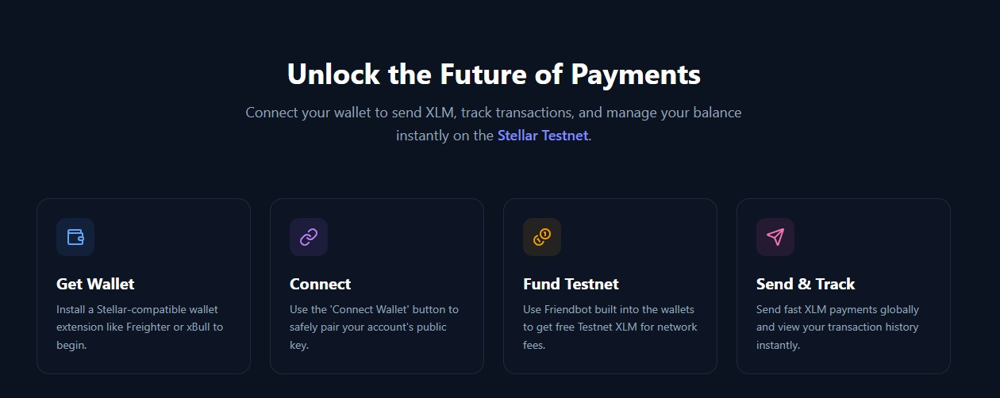
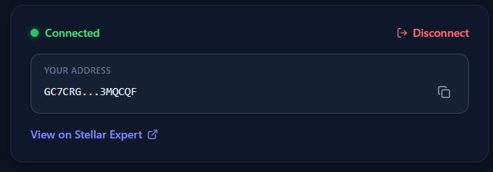
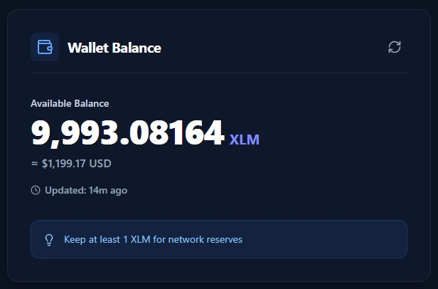
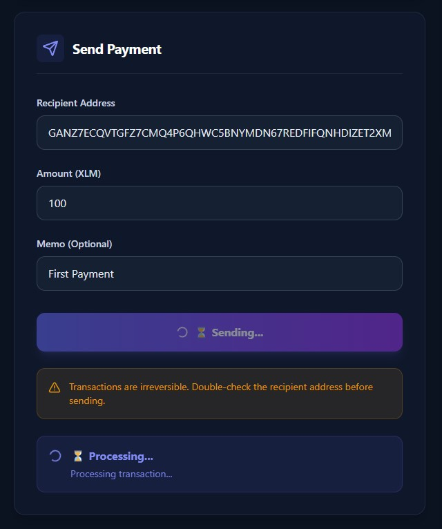
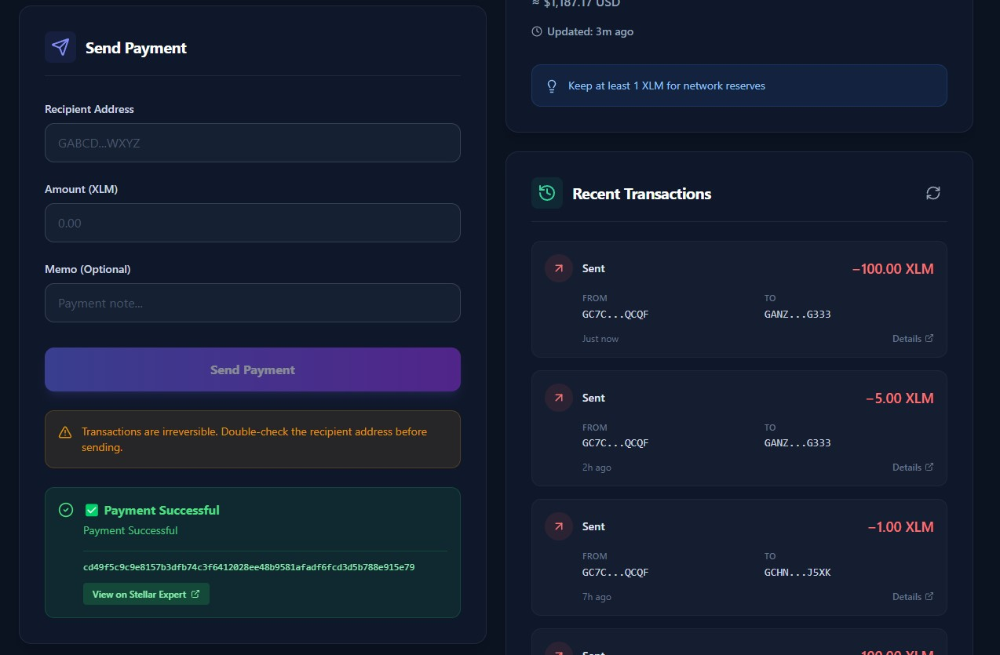
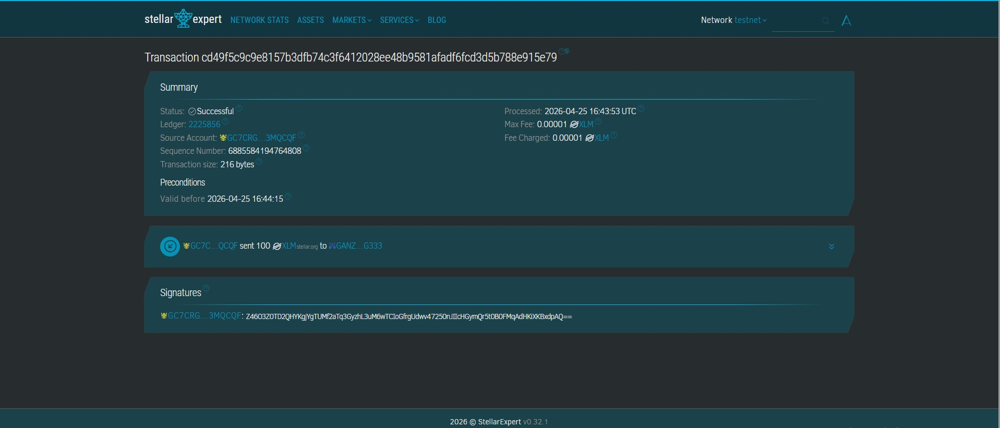

# 🌌 StellarPay — Web3 Payment Dashboard

A modern Web3 payment dashboard built on the Stellar Testnet.  
Connect your wallet, view your XLM balance, and send payments seamlessly with a clean and intuitive UI.

---

## ✨ Features

- 🔐 Connect Wallet (Freighter)
- 💰 View XLM Balance
- 💸 Send XLM Payments
- 📜 Transaction History
- 🔗 View transactions on Stellar Explorer
- ⚡ Real-time feedback (success / failure)
- 🎨 Modern UI built with Tailwind CSS

---

## 🧠 How It Works

This app uses the Stellar Testnet to simulate real blockchain transactions.

- Wallet connection via Freighter
- Transactions signed securely by the wallet
- Balance & transaction data fetched from Stellar network

---

## 📸 Screenshots

> 📁 Add your screenshots inside `/screenshots` folder and update paths below
> 
> 
> 

---

### 🔐 Wallet Connected



---

### 💰 Balance Displayed



---

### 💸 Sending Transaction



---

### ✅ Successful Transaction



---

### 🔗 Transaction on Blockchain (Proof)



---

## 🛠️ Tech Stack

- ⚛️ React
- 🎨 Tailwind CSS
- 🌐 Stellar SDK
- 🔑 Freighter Wallet
- 🚀 Stellar Testnet

---

## ⚙️ Setup & Run Locally

### 1. Clone the repository

```bash
git clone https://github.com/YOUR_USERNAME/YOUR_REPO.git
cd YOUR_REPO
```

2. Install dependencies
   npm install
3. Start the app
   npm start
4. Open in browser
   http://localhost:3000
   🧪 How to Test Transactions
   Install Freighter wallet
   Switch to Testnet
   Fund your account using:
   👉 https://friendbot.stellar.org/
   Connect wallet in app
   Send XLM to another test address
   🎯 Project Requirements Covered
   ✅ Wallet Setup (Freighter + Testnet)
   ✅ Wallet Connect / Disconnect
   ✅ Fetch & Display Balance
   ✅ Send XLM Transaction
   ✅ Transaction Feedback (Success / Failure)
   ✅ Transaction Hash + Explorer Link
   📌 Notes
   This project runs on Stellar Testnet
   No real funds are used
   Transactions are verifiable on:
   👉 https://stellar.expert/explorer/testnet
   🚀 Future Improvements
   📊 Balance chart
   📱 Better mobile responsiveness
   🔍 Transaction search
   🌙 Dark/Light mode toggle
   👨‍💻 Author

Archisman Mitra

⭐ If you like this project

Give it a ⭐ on GitHub!
